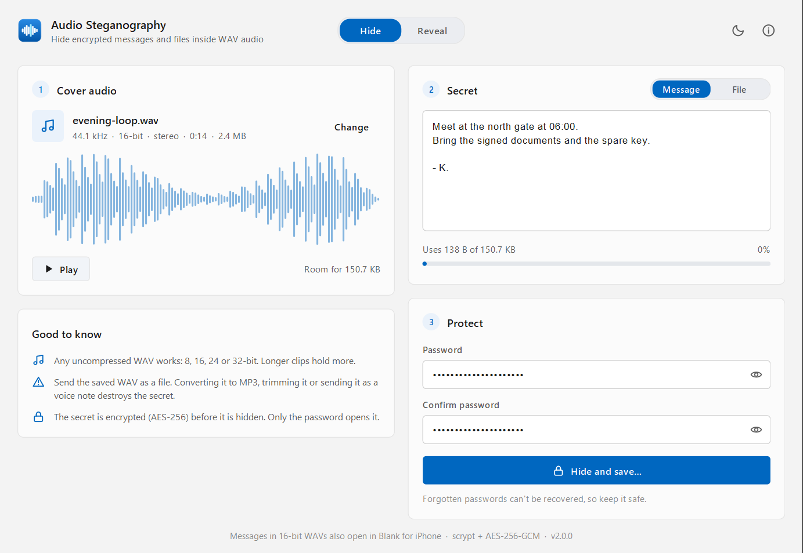
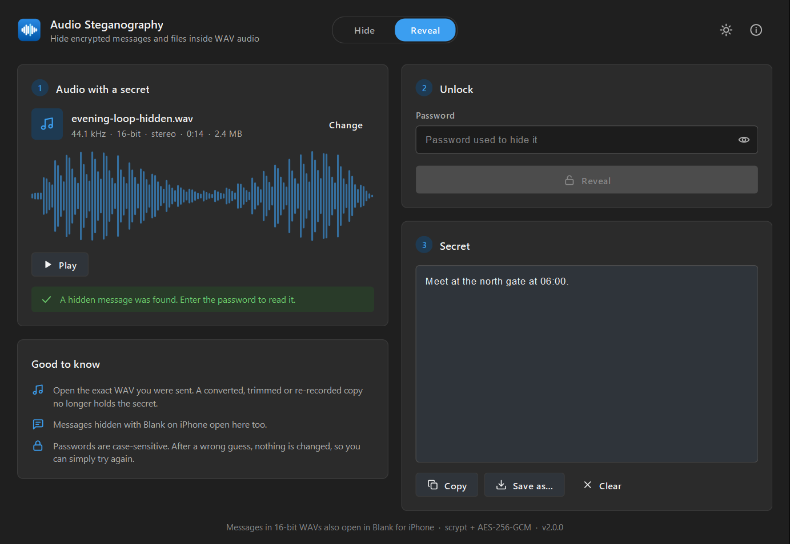

# Audio Steganography

Hide encrypted messages and files inside WAV audio. Only someone with the
password can get them back, and the audio sounds the same.

A desktop app (Windows, macOS, Linux) plus a command-line tool, built on a small
dependency-free Java engine. Text messages use the same format as the Blank
iPhone app, so a message hidden on either side opens on the other.

| Hide | Reveal (dark theme) |
|---|---|
|  |  |

## Features

- **Hide a message or a whole file** (any type, compressed automatically, original name kept).
- **Strong encryption:** scrypt (N = 2^14, r = 8, p = 1) password stretching + AES-256-GCM.
  A wrong password or a modified file is reported, never turned into garbage.
- **Inaudible:** one bit per sample, written to the lowest bit only, so every sample
  moves by at most one step.
- **Any PCM WAV:** 8, 16, 24 or 32-bit integer, mono to multichannel,
  WAVE_FORMAT_EXTENSIBLE, files with extra chunks (LIST, bext…), any length up to 2 GB.
- **Cross-platform with Blank (iOS):** text in 16-bit WAVs opens in both apps.
- **Modern desktop UI:** drag and drop, waveform preview with playback, live capacity
  meter, light/dark theme that follows the OS, keyboard shortcuts (Ctrl+O, Ctrl+1/2).
- **CLI** for scripts: `hide`, `reveal`, `info`.

## Run it

Needs Java 21 or newer ([Temurin](https://adoptium.net) is a good choice).

```bash
java Build.java
```

```bash
java -jar dist/audio-steganography.jar
```

Double-clicking `dist/audio-steganography.jar` also opens the app on most systems.

For a self-contained app that needs no Java installed (bundles a trimmed
runtime, about 77 MB):

```bash
java Build.java package
```

Then run `dist/app/Audio Steganography/Audio Steganography.exe` (Windows) or the
equivalent launcher on macOS/Linux.

## Command line

```text
audio-steganography hide <cover.wav> <out.wav> --text "message"
audio-steganography hide <cover.wav> <out.wav> --text -          (message from stdin)
audio-steganography hide <cover.wav> <out.wav> --file <secret.pdf>
audio-steganography reveal <stego.wav> [--out <file-or-folder>]
audio-steganography info <file.wav>
```

Run it as `java -jar dist/audio-steganography.jar <command> …`. Passwords are never
taken as arguments (they would end up in shell history): you are prompted, or
the `STEGO_PASSWORD` environment variable is used when set. Existing files are
never overwritten without `--force`.

On Windows, Java receives command-line arguments in the system code page, so
characters outside it (emoji, many scripts) arrive as `?`. Pipe such text in
with `--text -` and use `reveal --out message.txt` to get it back exactly.

## Build and test

```bash
java Build.java test
```

`Build.java` is the whole build: it compiles with `--release 21 -Xlint:all -Werror`,
runs the test suite in a separate headless JVM, then packages the jar. No Maven,
Gradle or downloads. Targets: `jar` (default), `test`, `package`, `clean`.

The tests (in-repo runner, no JUnit) cover RFC 7914 scrypt vectors, WAV parsing
edge cases, round trips at every bit depth and channel layout, tamper and
wrong-password detection, capacity limits, file-name sanitising, the CLI, and
**golden files written by Blank's own TypeScript engine** (see
[`src/test/resources/golden`](src/test/resources/golden/README.md)).

## How it works

```text
cover.wav ──► parse RIFF chunks ──► encrypt secret ──► write bits into sample LSBs ──► stego.wav
                                    scrypt + AES-GCM    1 bit per sample, MSB first
```

Hidden bitstream, starting at the first sample:

| Bytes | Field |
|---|---|
| 4 | Magic: `BLNK` = text message (Blank-compatible), `BLNF` = file (desktop only) |
| 1 | Version: `BLNK` v2 (v1 from Blank 1.0.0 is still read), `BLNF` v1 |
| 4 | Payload length, big-endian |
| n | Payload: `logN (1) · salt (16) · nonce (12) · AES-256-GCM ciphertext + tag (16)` |

The plaintext of a `BLNK` payload is the UTF-8 message. For `BLNF` it is
`flags (1) · nameLength (2) · name · data`, with bit 0 of flags meaning zlib
compression. The file name is encrypted along with the data and sanitised on
the way out, so a crafted file can't write outside the folder you choose.

A message costs 54 bytes of overhead. A 16-bit stereo 44.1 kHz clip holds
about 11 KB per second.

## Limits, honestly

- **It hides the content, not the fact that something is hidden.** The header
  is unencrypted, so anyone with this tool (or Blank) can tell a file carries a
  secret, but can't read it without the password.
- **The WAV must stay bit-for-bit identical.** Converting to MP3/AAC, trimming,
  normalising, or sending through apps that re-encode audio destroys the secret.
  Share it as a file (zip, cloud storage, email attachment).
- **Password strength is up to you.** scrypt makes each guess expensive, but a
  short or common password can still be guessed. There is no recovery.
- Blank (iOS) reads 16-bit PCM WAVs only, and text only. Files and other bit
  depths open in this app.

## What changed from the 2020 version

The original (still in this repo's history, commit `2d950c2`) was a BSc final-year
project. Testing it on a 10-second WAV showed:

| 2020 | Now |
|---|---|
| Read into a fixed 154,600-frame buffer: longer files came back truncated and scrambled, with a header still claiming the old length | Chunk-walking parser; output differs from the input only in sample LSBs |
| Wrote into every byte, including the high byte of 16-bit samples (±256 steps, audible hiss) | Lowest byte only: at most ±1 step per sample |
| `PBEWithMD5AndDES`, hardcoded salt, 20 iterations, no integrity check | scrypt + AES-256-GCM, random salt and nonce per message |
| Wrong password wrote an empty file; a clean WAV crashed extraction (`NegativeArraySizeException`) | Typed errors: wrong password, no message, too large, unsupported, damaged |
| Password printed in the on-screen log; typed messages left unencrypted in `%TEMP%` | Passwords never printed or written; nothing secret touches disk except the output you choose |
| Hardcoded login, dead "quality" and "comment" fields, playback through the Applet API (deprecated for removal) | Single-window UI, playback for every supported depth |
| No build file or tests | `java Build.java`: 46 tests, CI on Windows and Linux |

## Project layout

```text
Build.java                          zero-dependency build script
src/main/java/com/phopho/audiosteganography/
  engine/    WavFile, Lsb, Scrypt, Crypto, Secret, Stego, …  (no UI or file I/O)
  cli/       command-line interface
  ui/        Swing desktop app (custom Fluent-style components, no look-and-feel library)
src/test/    tests, test runner, golden fixtures from Blank
```

## Credits

Based on the 2020 BSc Computer Engineering project *"Design and Implementation
of an Audio Steganographic System for Data Transmission"* by Kudjordji Emmanuel
and Agyare Samuel Marrion (Ghana Technology University College).
